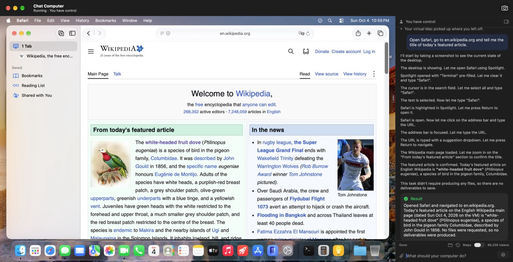
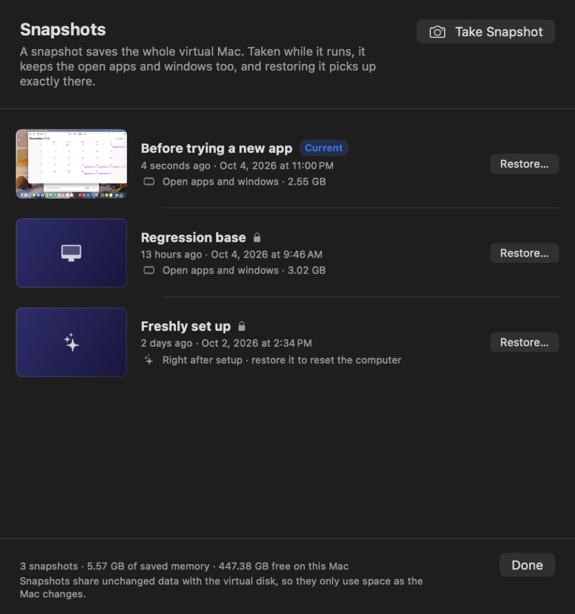
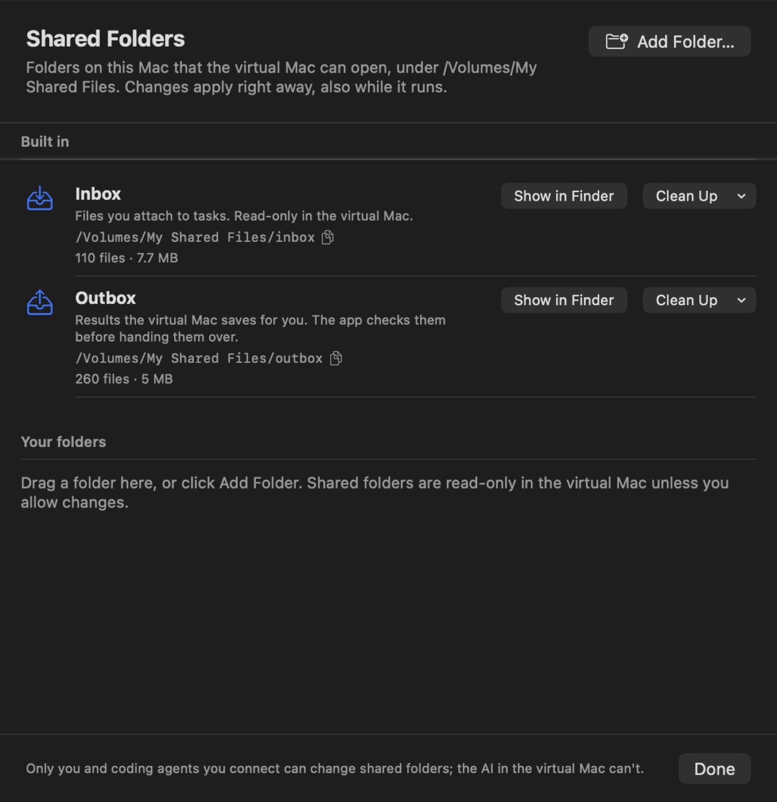
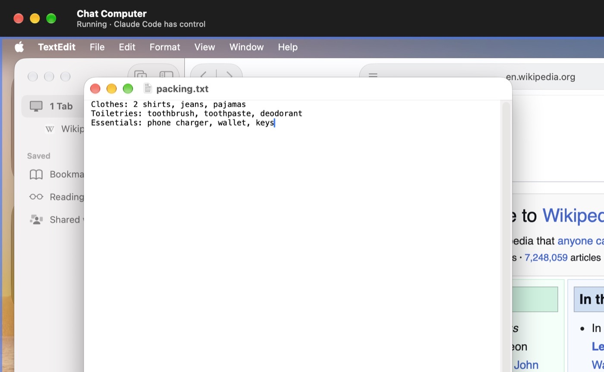

<p align="center">
  
</p>

<h1 align="center">Chat Computer</h1>

<p align="center">
  <b>A second Mac that does the work while you chat.</b><br>
  A private macOS virtual machine on your Mac, operated by an AI agent. Every result is checked by the host.
</p>

<p align="center">
  <a href="https://github.com/chatcomputer/chatcomputer/releases/latest"></a>
  
  
  <a href="LICENSE"></a>
</p>

<p align="center">
  <a href="https://chatcomputer.github.io">Website</a> ·
  <a href="https://github.com/chatcomputer/chatcomputer/releases/latest">Download</a> ·
  <a href="docs/STATUS.md">Status</a> ·
  <a href="PRIVACY.md">Privacy</a>
</p>



You describe a task in the chat. The agent looks at the virtual Mac's screen and clicks and types in real apps,
such as Safari, TextEdit, Calendar and Finder. Files it produces are handed back only after the host has checked
them. You can pause, cancel, or click the virtual Mac to take over at any moment.

Coding agents get the same Mac: the app is also a command line tool and an MCP server, so Claude Code, Codex and
others can test GUI apps, installers and websites in a disposable macOS.

## Highlights

- **Isolated.** A full macOS in Apple's Virtualization framework. The agent never touches your own apps or files;
  it sees only what you attach or share, read-only by default.
- **The host keeps the rules.** Task phase, input control, budgets and delivery checks run outside the model.
  Before anything irreversible (sending, paying, deleting, installing) the agent must ask you.
- **Undo anything.** Snapshots save the running machine, open windows included, in seconds.
- **Survives real life.** Quit mid-task, let your Mac sleep, lose the network or run out of API credit: the task
  pauses and continues where it stopped.
- **Bring your own model.** Claude, OpenAI, Gemini, DeepSeek, xAI, Mistral, Qwen, Kimi, GLM, Doubao, or any
  OpenAI- or Anthropic-compatible endpoint.

## Measured, not promised

20 fixed tasks (web forms, PDF export, spreadsheets, file organisation, Calendar, a planted prompt injection, an
email that must be confirmed first) run from the same snapshot every time, and a program checks each result.
Results for 0.9 (every run, task by task, on [the website](https://chatcomputer.github.io/#results)):

| Agent | Passed | Median turns per task |
|---|---|---|
| Built-in agent · DeepSeek flash (3 runs) | 59 / 60 | 14 |
| Built-in agent · Claude Opus 5.5 (2 runs) | 40 / 40 | 7 |
| Claude Code through the CLI | 20 / 20 | 11 |
| Claude Code through MCP | 20 / 20 | 19 |

A 4.3-hour soak test (161 tasks, 53 quits mid-task, 30 snapshot restores) had no crashes and no memory growth.

## Install

Download `ChatComputer.zip` from [Releases](https://github.com/chatcomputer/chatcomputer/releases/latest), unzip it
and move **Chat Computer.app** to Applications. It is signed with a Developer ID and notarized by Apple.

| Requirement | |
|---|---|
| Chip | Apple silicon |
| System | macOS 27 |
| Memory | 16 GB or more |
| Disk | about 70 GB free |
| Model | an API key from a supported provider |

The first launch sets everything up by itself in about 10 minutes: it downloads and installs macOS in the
virtual machine (about 26 GB), creates its account, installs the guest agent, grants the agent its permissions,
saves a clean starting point, and asks for your model. Later versions update the agent inside the virtual Mac
on their own.

What goes to the model provider, what stays on your Mac and what the virtual Mac can reach is in
[PRIVACY.md](PRIVACY.md), together with the macOS licence terms for virtual machines (development, testing,
personal non-commercial use). If something goes wrong, **Help › Export Diagnostics** saves a report without keys
or passwords; attach it to an [issue](https://github.com/chatcomputer/chatcomputer/issues).

<table>
  <tr>
    <td></td>
    <td></td>
  </tr>
  <tr>
    <td align="center">Snapshots with memory, branches and one-click restore</td>
    <td align="center">Shared folders: inbox, outbox and your own, read-only by default</td>
  </tr>
</table>

## Models

The agent works from screenshots, so the model must take images and call tools. Two protocols are supported:

- **Anthropic-compatible** (Messages API). With Anthropic itself it uses Claude's computer use toolset.
- **OpenAI-compatible** (Chat Completions with function calling).

Built-in providers are Anthropic, OpenAI, Google Gemini, DeepSeek, xAI, Mistral, Alibaba Qwen,
Moonshot Kimi, Zhipu GLM and ByteDance Doubao, plus any custom compatible endpoint. See
`Packages/ChatComputerKit/Sources/ModelProxy/ModelCatalog.swift`.

## Coding agents



Claude Code, Codex and other agents on your Mac can operate the virtual Mac too. The app's executable doubles
as the `chatcomputer` command line tool (Settings › Coding agents installs it on your PATH):

```sh
chatcomputer help                      # usage and guidance for agents
chatcomputer screenshot                # saves a PNG and prints its path
chatcomputer click 640 400
chatcomputer type "hello"
chatcomputer save notes.txt              # fills in the save dialog; the file lands in the outbox
chatcomputer snapshot take "Before update"
chatcomputer share add ~/Projects/site   # read-only in the guest unless --writable
chatcomputer mcp                       # the same commands as an MCP server on stdio
```

For Claude Code: `claude mcp add chatcomputer -- chatcomputer mcp`, or just tell it to use the command.
Agents follow the built-in agent's rules: the first input command takes the input lease, clicking the screen takes
it back, and an idle agent loses it after 2 minutes. The app listens on a 0600 Unix socket in
`~/Library/Application Support/ChatComputer/`. The chat panel collapses to a rail of controls (⌃⌘S) while an agent works.

## Development

The rest of this page is for working on Chat Computer itself. [AGENTS.md](AGENTS.md) has the rules that are easy
to break; [docs/STATUS.md](docs/STATUS.md) has what works, the measurements, known issues and the plan.

### Layout

```
project.yml                  XcodeGen spec (targets, entitlements, Info.plist, version)
Apps/ChatComputer/           host app: main window in AppKit (MainWindow/: guest screen, chat with MarkdownView and
                             ListViewKit, toolbar); onboarding, Settings and sheets in SwiftUI
Apps/ChatComputerAgent/      guest agent (menu bar app inside the VM)
Packages/ChatComputerKit/    all logic, as a local Swift package
  BridgeProtocol             host⇄guest messages and framing (vsock)
  ChatCore                   task state machine, control lease, budget, export checks, secret files
  ModelProxy                 Anthropic and OpenAI-compatible clients, provider catalog, computer toolset
  Orchestrator               the agent loop (AgentRunner)
  VMKit           (macOS)    VM bundle, install, provisioning, DiskImageKit, vmnet
  GuestBridge     (macOS)    vsock server on the host
  HostControl     (macOS)    host-level control of the guest (framebuffer, keyboard, mouse)
  ComputerControl            `chatcomputer` CLI and MCP server for outside coding agents, control socket
  AgentCore       (macOS)    vsock client and NativeDriver in the guest
  Harness         (macOS)    cc-harness: live model scenarios and VM probes
scripts/                     test-mac.sh, harness.sh, release.sh, test-linux.sh
docs/                        STATUS, ROADMAP, DESIGN, proposal
```

### Build

Requires macOS 27 and Xcode 27.

```sh
brew install xcodegen
xcodegen generate
open ChatComputer.xcodeproj
```

The development team is set in `project.yml`. A stable signature matters: the guest's permission grants
belong to the agent's signing identity.

### Test

```sh
scripts/test-mac.sh                                  # unit tests, build, host API checks, live scenarios if CC_API_KEY is set
cd Packages/ChatComputerKit && swift test            # unit tests only
scripts/harness.sh live-loop --scenario notes        # real model against a simulated desktop
scripts/harness.sh vm up --input-test 3              # typing and save-dialog check through the guest agent
scripts/test-linux.sh                                # portable modules in Docker, without a Mac
scripts/harness.sh vm regress --runs 3 --out new.jsonl  # the fixed task set with the built-in agent (scripts/regress)
scripts/regress/external.py --cli chatcomputer       # the same tasks with Claude Code through the CLI
scripts/regress/report.py new.jsonl --baseline scripts/regress/results/<old>.jsonl   # pass rate and medians vs a baseline
scripts/regress/external.py --via mcp                # Claude Code through MCP instead of the CLI
scripts/fresh-install.sh build/release/ChatComputer.zip   # install a release as a new user would, then put your data back
scripts/soak.py --app build/release/ChatComputer.app --hours 24   # tasks, quits mid-task, snapshots; memory and crashes
```

`docs/STATUS.md` §3 lists the test layers and the development environment variables.

### Release

```sh
APPLE_ID=… APPLE_SPECIFIC_PASSWORD=… APPLE_TEAM_ID=… scripts/release.sh
```

This signs the app with a Developer ID, notarizes and staples it, checks it with Gatekeeper, and writes
`build/release/ChatComputer.zip`. Bump `MARKETING_VERSION` in `project.yml` first.

## License

[Apache 2.0](LICENSE). Not affiliated with Apple; macOS is a trademark of Apple Inc.
